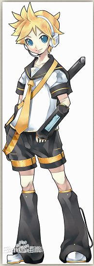

# 模组信息

日文名：镜音レン（かがみね レン)草稿专用  
中文名：镜音连  
罗马音：Kagamine Ren  
年龄：14 岁  
身高：156cm  
体重：47kg  
擅长的曲种：舞曲及摇滚式流行曲、歌谣曲～演歌系流行曲  
擅长的节奏：70 ～ 160BPM  
擅长的音域：D3 ～ C#5  
代表物：香蕉、压路机  
同人设定：可爱、活泼、冷漠、温柔、腹黑、病娇等  
常用昵称：连殿，连君，香蕉，连困，弟弟（相对于镜音铃而言，但官方设定两人无血缘关系，弟弟只是爱称）  
代表色：明黄色  
CV：下田麻美

## 人设

### 人设细节

#### 面板

<a href="./vocaloid.ai">下载文件</a>

## mmd 模型

<iframe style="border: 0" :src="$withBase('/pmx/index.html#PDAFT Default Len/PDAFT Default Len.Pmx')" width="100%" height="600"></iframe>
